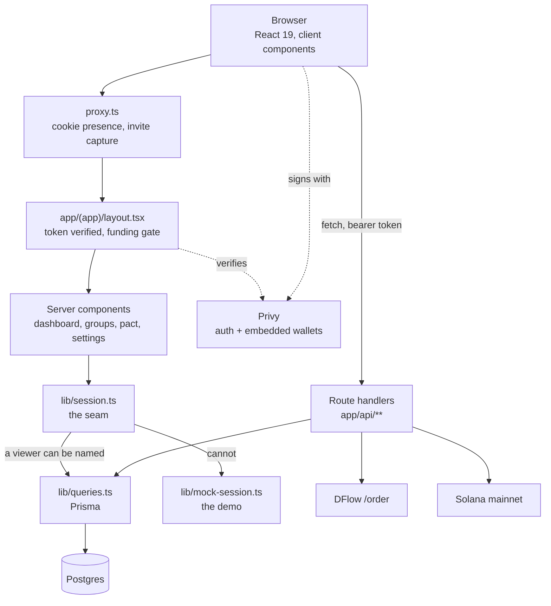
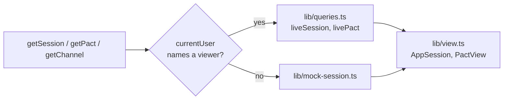
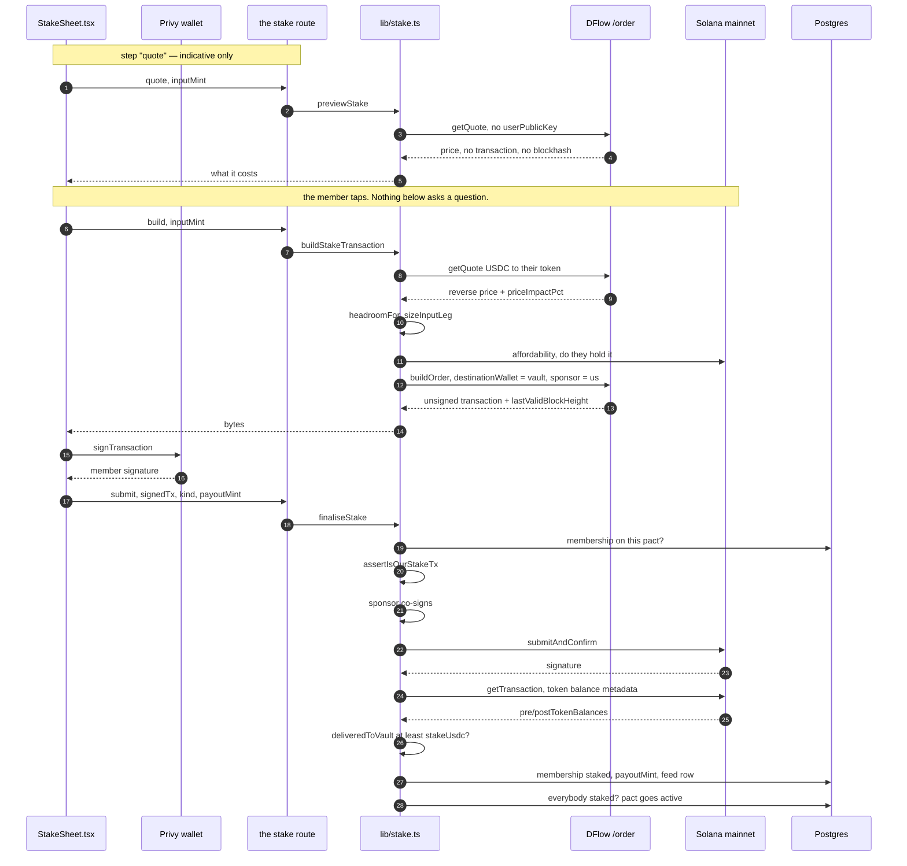
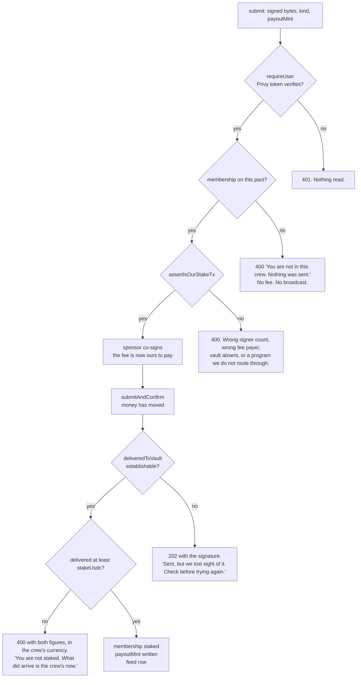
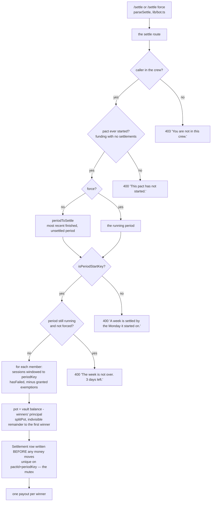
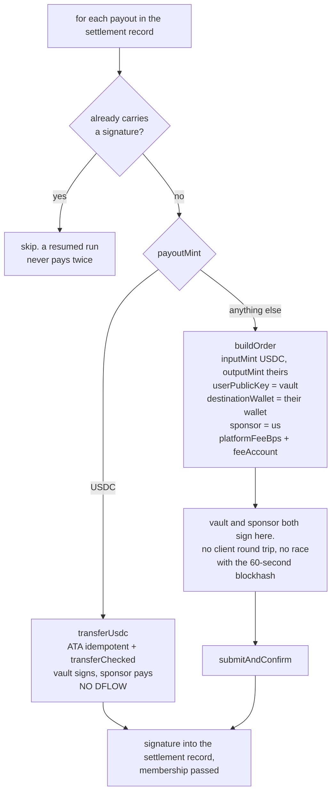
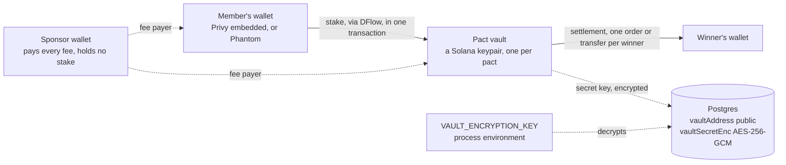
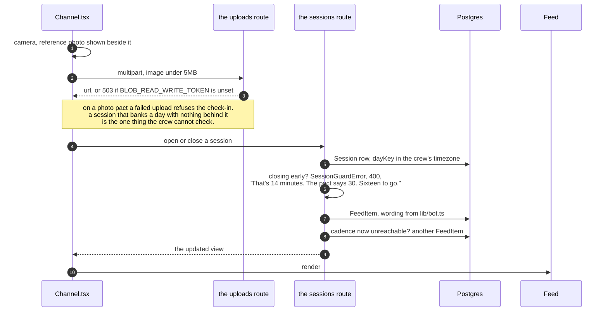

# Architecture

How the money gets in, how it gets out, and what sits between a browser and a Solana mainnet
transaction. Written for somebody who has not seen this repository before.

Custody is not covered here beyond where the money physically sits. That question has its own
document, [`docs/security/escrow-protocol.md`](security/escrow-protocol.md), which states who can
move a vault and how the on-chain replacement would differ.

Every claim below is checkable against the files it names. Symbols are named rather than line
numbers, because lines move.

---

## 1. The shape of the thing

A Next.js 16 App Router application, one process, Postgres behind Prisma, Privy for sign-in and
wallets, DFlow for every conversion, and the Solana mainnet for every transfer. There is no
scheduler, no queue and no background worker. Everything happens inside a request.

Two gates, split by what each costs. `proxy.ts` runs on every navigation and only asks whether a
`privy-token` cookie is present, because Next 16's proxy convention runs separately from render
code and must not reach for crypto, a database or an RPC. `app/(app)/layout.tsx` does the real
work: it verifies the token's signature and reads `walletFundedAt`. A forged cookie gets past the
first and no further.

### The seam

`lib/session.ts` decides once, for the whole server, whether a screen reads Postgres or the demo.
It branches on whether a viewer can be named at all, which collapses three separate situations
into one answer: no database configured, no Privy app configured, and simply not being signed in.

Both sides resolve to the same types in `lib/view.ts`, so no screen knows which it got. The mock is
loaded by dynamic import, so it never enters the production bundle when a database is configured,
and deleting the file breaks only the fallback branches. `lib/channel-client.ts` is the same seam
on the client, branching on the same condition.

This is what keeps `npm run dev` with an empty environment working end to end: the fallback is a
furnished demo rather than an error page.

---

## 2. The money path in

A member stakes in whatever token they hold, and it arrives in the pact's vault as USDC in one
transaction that the member does not pay a fee for. That is `PRODUCT.md`'s fifth principle made
mechanical, and it is the half of the DFlow story with a person in it.

Three things in that sequence are decisions rather than plumbing.

**The price on screen and the order that gets signed are different calls.** DFlow's order carries a
blockhash good for about 149 blocks, roughly a minute. A flow that shows a price, waits for somebody
to read it, and then signs is a flow whose transaction is dead before it reaches the chain. So the
sheet shows `getQuote` output, which has no `userPublicKey` and therefore no transaction and no
blockhash, and `buildOrder` runs on the tap.

**The input leg is sized by pricing the reverse direction.** `swapMode=ExactOut` is accepted by the
API and silently ignored, so "deliver exactly this much USDC" has to be approximated: ask what the
stake is worth in the member's token, then over-send by `headroomFor`, which is at least 3% and
rises with price impact. If the resulting order's `minOutAmount` still falls below the stake, it
retries once with wider headroom and then refuses. A token whose probe shows over 1% impact is
refused outright as too thin to price a stake in.

**The vault's token account is created by the route, at the sponsor's expense.** A brand-new pact
vault needs no setup and never needs SOL of its own.

### Where the guards sit, and what each refuses

Guards are ordered by cost. Everything that can refuse before the sponsor's key is used does so,
because a refusal after that point costs a transaction fee, and a refusal after the broadcast costs
somebody real money.

`assertIsOurStakeTx` checks shape and never size: two required signatures, the sponsor at account
index 0 as fee payer, this pact's vault among the accounts, and only the programs a DFlow route
touches, or ComputeBudget plus Token plus ATA on the plain USDC path. It cannot check the amount.
The swap path's delivered output is not in the bytes at all, and address-table lookups mean even
the transfer path's accounts are not all present to decode. What it cannot stop is somebody getting
the sponsor to pay for a different DFlow swap that still lands in this vault, which is a donation
to the crew priced at one transaction fee.

The amount is established afterwards, from the transaction that landed. `deliveredToVault` asks the
chain what that one signature moved, using `getTransaction`'s `preTokenBalances` and
`postTokenBalances`, which are recorded per account for that signature, cover accounts loaded
through address-lookup tables, and name each row's `owner` and `mint`. It returns `null` for
"could not establish" and never zero, and every `null` ends in a refusal:

| Not knowing | Answer |
|---|---|
| the lookup throws | refuse, and do not retry — an erroring node is not a node that is behind |
| the transaction is not served back in four attempts at 700ms | refuse |
| `preTokenBalances` or `postTokenBalances` is absent rather than empty | refuse |
| a USDC row does not name its `owner`, in either spelling of absent | refuse |
| an amount does not parse as an integer | refuse, and log it |

The two refusals answer differently on purpose. *Delivered short* is a fact about the member's
transaction, so it is a 400 with a sentence they can act on. *Could not establish* is a fact about
us, so it is a 202 carrying the signature and a do-not-retry, because a member told their stake
failed will stake again and pay twice.

### The USDC path

DFlow cannot route a mint to itself, and a member funded from an exchange most likely holds exactly
USDC. That path skips the router entirely: `buildUsdcStake` composes an idempotent ATA creation and
a `transferChecked`, with the sponsor still as fee payer, so this member also needs no SOL. It is
the path the amount guard exists for, because it is the one a member can hand-build.

### Rehearsal

With `STAKE_DRY_RUN=1` the whole path runs and only the broadcast is skipped. The route is priced,
the member signs, the sponsor co-signs, the guard passes, and the transaction is simulated against
live mainnet with `sigVerify: true`. That verifies the one thing reading code cannot: whether a
wallet's signing round trip leaves the sponsor's signature slot intact. The membership is still
written, with a signature of `dry-run:<timestamp>` that cannot be mistaken for one. The delivery
check is skipped, necessarily, because nothing was broadcast for it to attribute.

---

## 3. The money path out

`/settle` in the channel, or `POST /api/pacts/:id/settle` directly. There is no scheduler, so a
period is closed when a member says it is closed.

The two commands mean two different periods, which is the whole point of having two of them.
`/settle` closes the week that has ended. `/settle force` closes the week that has not, which is
the only thing force is for and why it cannot share the default: on a pact minutes old the running
period is the only period there is.

Three details in the judging step are not obvious.

**Sessions are windowed to the period being settled, taken from `periodKey` and not from `now`.**
Those are the same period only when somebody settles the week they are standing in. Once a bare
`/settle` could target a finished one, a crew who went five for five and typed `/settle` on Monday
would have been judged against a week they had not started: nobody has a session in it, so
everybody fails, and the settlement row is the mutex, so there is no second run to put it right.
`periodDayKeysFrom` derives the window from the key by pure UTC key arithmetic, so daylight saving
cannot bite.

**A winner gets their own stake back plus a share.** Paying only the share would mean every member
loses their principal every period, which is not what "whoever breaks it forfeits their stake to
whoever kept it" says.

**The pot is the vault's actual balance minus the winners' principal, not losers × stake.** A
member staking a non-USDC token overpays by the slippage headroom, and that surplus belongs to the
crew rather than accreting in a wallet nobody can reach.

### One order per winner

A USDC payout has no DFlow in it, because DFlow cannot route a mint to itself and the vault already
holds USDC. So the second DFlow moment exists only when a winner chose something other than the
default, and `payoutMint` defaults to USDC in both the schema and the stake sheet's pre-selected
option. That is a fact about the demo as much as about the code.

`PAYOUT_MINTS` in `lib/dflow.ts` is an allowlist rather than free text, checked by
`isSupportedPayoutMint` before the column is written. Settlement builds a real order per winner, and
an unroutable mint there is a payout that silently never lands.

The `Settlement` row is written before any money moves, and `@@unique([pactId, periodKey])` makes
it the mutex. A throw part way through used to leave some winners paid and no record, so a re-run
paid them twice. Now a re-run resumes: anything already carrying a signature is skipped, and the
route answers a mid-flight failure with 202 and "run it again to pick up where it stopped".

If nobody failed there is no pot. If nobody passed there is no recipient, and the money stays in
the vault, because inventing a recipient for it would be worse than leaving it where the crew can
see it.

---

## 4. Where the money actually sits

Each pact gets its own keypair at creation. The public key is `Pact.vaultAddress` and is public by
nature, since it is where members send their stake. The secret key is encrypted with AES-256-GCM
under `VAULT_ENCRYPTION_KEY` and stored as `Pact.vaultSecretEnc`; it has never been sent to a
client. `settlePact` is the only function that moves USDC out of a vault.

Anyone holding both the database and that encryption key can move any vault. That is one key for
all vaults, with no rotation path and no escrowed copy, and the sponsor/vault key separation is
real in the code and worth nothing in practice because both keys live in the same process.
[`docs/security/escrow-protocol.md`](security/escrow-protocol.md) states the exposure precisely,
specifies the PDA-based v2 that replaces it, and gives fifteen threat-model rows with what each
design does about them. It is the document to read before deciding whether to trust this with money.

---

## 5. Data model

Nine tables. The parts that carry a decision:

| Table | Column | Why it is there |
|---|---|---|
| `Pact` | `stakeAmount`, `stakeCurrency`, `fxRateToUsd`, `stakeUsdc` | The crew agrees a figure in their own money and the rate is frozen at creation, so the target cannot drift mid-week. `stakeUsdc` is what the chain deals in; everything on screen converts back through the frozen rate. |
| `Pact` | `ruleConfig` Json | Cadence, period, window, proof type, minimum duration, exemption mode, duration in periods, and the reference photo URLs. Parsed by `RuleConfigSchema` at every read, so a row written by an older build fails loudly rather than silently. |
| `Pact` | `startsAt` | Null until every member has staked, and null again between periods. Nobody is exposed to a rule the rest of the crew has not paid for yet. |
| `Membership` | `payoutMint` | The token this member's share arrives in. Defaults to USDC. |
| `Membership` | `stakeTxSig`, `payoutTxSig` | The on-chain receipts for both directions. |
| `Session` | `dayKey` | The crew-local `YYYY-MM-DD` the session started on, computed once at write time in the pact's timezone. Every cadence question is a set operation over these. |
| `Settlement` | `payouts` Json | Per member: principal, share, chosen mint, and the signature once it lands. Wide because `totalPotUsdc / stakeUsdc` says how many members forfeited and never which ones, and `Membership.status` is overwritten the next period. Without this, "Dave owes ฿3,000 and has for five weeks" is unbackable by anything stored. |
| `Settlement` | `@@unique([pactId, periodKey])` | The mutex. It is what makes a settlement resumable rather than repeatable. |

---

## 6. Request lifecycle, end to end

One check-in, as an example of the ordinary case.

The refusal is the point. Checking out before the rule's minimum is refused at the moment it is
attempted rather than recorded and judged days later at settlement, because finding out
immediately is what the crew is paying for.

Every sentence the bot says is built in `lib/bot.ts` and nowhere else, so the API routes that write
feed rows and the screen that answers slash commands cannot drift into two voices.

---

**Files this document describes:** `lib/dflow.ts`, `lib/stake.ts`, `lib/settlement.ts`,
`lib/session.ts`, `lib/queries.ts`, `lib/mock-session.ts`, `lib/bot.ts`, `lib/rules.ts`,
`lib/solana.ts`, `lib/vault.ts`, `lib/auth.ts`, `lib/view.ts`, `proxy.ts`,
`app/(app)/layout.tsx`, `app/api/pacts/route.ts`, `app/api/pacts/[id]/stake/route.ts`,
`app/api/pacts/[id]/settle/route.ts`, `app/api/pacts/[id]/sessions/route.ts`,
`app/api/uploads/route.ts`, `app/api/wallet/balance/route.ts`, `app/api/me/route.ts`,
`components/StakeSheet.tsx`, `components/Channel.tsx`, `prisma/schema.prisma`.
