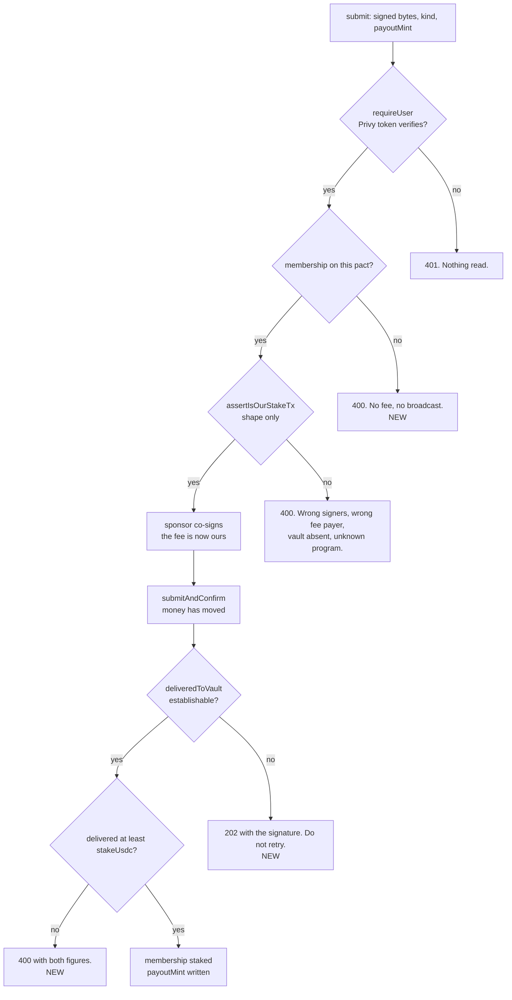

# Consistently: buildathon submission

A crew agrees a rule and each member stakes real money on keeping it. Whoever breaks the rule
forfeits their stake to the people who kept it, automatically. This branch takes that from a
half-built app to something deployed and defensible: `namearth5005/buildathon-demo`, 78 commits
ahead of `pact-build` across 81 files, of which the last 47 commits and 30 files are the
buildathon plan itself.

Live at **https://web-production-8764a.up.railway.app**, on Solana mainnet.

New documents in this branch: [`docs/ARCHITECTURE.md`](docs/ARCHITECTURE.md) for the flow,
[`docs/security/escrow-protocol.md`](docs/security/escrow-protocol.md) for custody. The README has
been rewritten and is accurate as of this head.

## Read this part first

Two money-path defects were found in pre-existing code, both while writing the custody document
rather than while testing it. Neither was in code any planned task had been asked to touch. Both
are fixed here.

### The stake guard checked shape and never amount

`assertIsOurStakeTx` verified that what it was being asked to co-sign looked like an order we had
built — two signers, our sponsor as fee payer, this pact's vault present, only the programs a DFlow
route touches — and never read how much USDC the transaction delivered. On the plain USDC path a
member could hand-build that exact shape carrying one atomic unit and be recorded fully staked.
`settlePact` pays each winner a whole principal back out of the vault's *actual* balance, so an
under-staker who kept the rule would have been paid a full stake out of the money the rest of the
crew put in, and the shortfall would have landed on whoever the payout loop reached last.

The guard is still structural and still cannot check the amount: the swap path's delivered output
is not in the bytes at all, and address-table lookups mean even the transfer path's accounts are
not all present to decode. So the amount is no longer taken from the transaction we are asked to
sign. It is taken from the transaction that landed. `deliveredToVault` asks the chain what that one
signature moved, from `getTransaction`'s `preTokenBalances` and `postTokenBalances`, which are
recorded per account for that signature, cover accounts loaded through address-lookup tables, and
name each row's `owner` and `mint`.

**The first version of this fix was wrong and is worth knowing about**, because the wrong version
is the one most reviewers would write. It read the vault balance either side of the broadcast and
required the rise to cover the stake. Any USDC landing in that window counts, including the
attacker's own: two seats in a crew, two calls carrying one atomic unit each, one full stake sent
from an outside wallet timed to confirm inside both windows, and both memberships are written
against one stake. It generalises to N seats and the timing is the attacker's to choose. A delta is
attribution by assumption; the transaction's own record is attribution by evidence.

`deliveredToVault` returns `null` for "could not establish" and never zero, and every `null` ends
in a refusal. Collapsing those two is exactly how the first version failed open, so the enumeration
is deliberate: an erroring lookup refuses and is not retried, a transaction not served back within
four attempts at 700ms refuses, an absent balance array refuses (`Array.isArray`, not truthiness —
`[]` is truthy and `?? []` reads an absent `pre` as "the vault held nothing", which attributes four
other members' stakes to a transfer of one unit), a USDC row that does not name its `owner` in
either spelling refuses, and an unparseable amount refuses and logs.

### A non-member could deliver a full stake and be answered with a 500

`finaliseStake` read the membership for the first time at the `update` that records the stake, which
is after the broadcast. A caller with no row on the pact could put their money into a crew's vault
and get back a `P2025` on a key naming nothing, which the route turns into HTTP 500 and *"That did
not go through"* — said to somebody whose transaction had just confirmed. That sentence is what
makes a person stake a second time and pay twice, which is the outcome the amount fix is arranged
around avoiding, reached through a door it did not cover.

The membership is now read first, before `loadSponsor` and before `signWith`, so a refused
non-member costs no sponsor fee either. The read replaced the user lookup that used to happen after
the broadcast rather than being added to it, so it is the same single query.

### Where the guards now sit

The two post-broadcast refusals answer differently on purpose. *Delivered short* is a fact about the
member's transaction, so it is a 400 with a sentence they can act on. *Could not establish* is a
fact about us, so it is a 202 carrying the signature and a do-not-retry.

## The rest of the branch

**A payout token per member.** A winner picks at stake time which token their share arrives in;
settlement builds a real DFlow order per winner rather than one for the pot. `PAYOUT_MINTS` is an
allowlist checked by `isSupportedPayoutMint`, because an unroutable mint is a payout that silently
never lands. Written in the same Prisma update as the status flip: a second write that can fail on
its own leaves a staked member holding the default, and nobody finds out until settlement pays the
wrong token.

**A settlement feed line that names the token.** `settlementLine` reports each winner's total in
the crew's own currency at the pact's frozen rate, not in USD. Every other figure in the product
goes through `formatMoney` in `stakeCurrency`, and the seeded demo pact is in baht, so a hardcoded
`$` would have printed the one figure on screen that disagreed with all of them. It stays a pure
function taking `usdRate` and `currency`, so the sentence assembly is testable by hand; the test
uses THB deliberately, since USD is the one currency where the conversion is invisible.

**`/settle` works, and `/settle force` exists.** Both were broken in ways no single task's review
could have caught, because both were seams. A bare `/settle` defaulted to the current period's key,
which the still-running guard refuses by definition, so no unforced settle could succeed for any
crew on any day; a member would then read `/help`, find `force`, and type the destructive command
to get any result at all. `periodToSettle` now resolves the most recent finished, unsettled period,
walking back no further than the pact's own beginning. `force` still targets the running period,
gated by `parseSettle` on the exact word and by `force: z.boolean()` compared `=== true` on the
server, so a typo, an extra word, `"yes"` or `1` all fail rather than falling through.

Opening that path exposed three latent bugs behind it, which is the reviewable pattern of this
branch: `settledLine` was being called with the winner count in the `failed` argument, so one
member missing in a crew of four announced "Three missed"; the day-key window for judging came from
`now` rather than from `periodKey`, so settling last week judged this one; and a pact that never
started could be settled against whoever had paid. All three are separate commits.

**Check-in photos go through `/api/uploads`.** They were `URL.createObjectURL(file)` — a `blob:`
string persisted to Postgres and rendered for every other device as a broken image. The new
endpoint takes images under 5MB from a verified caller, answers 503 without `BLOB_READ_WRITE_TOKEN`
rather than throwing, and is now the only upload path: reference photos, avatars and check-in
photos all use it.

**Reference photos.** The creator uploads what a good check-in looks like plus a 280-character
description, shown next to the camera at check-in. Nothing compares them; the crew does.

**Profile and email linking.** `PATCH /api/me` takes name, bio, avatar and four socials, with the
caller read from a verified token and the schema stripping anything it does not name. Email links
through Privy's own flow, with the `@unique` column and Privy's error code both refusing an address
already attached to somebody else.

**A GitHub contribution calendar** in Settings, rebuilt from the 21st.dev component onto
`var(--ink)` at rising opacity, because `DESIGN.md` reserves green and red for money. Removing the
colour tables removed the dark-mode branch and a `MutationObserver` watching for a `.dark` class
this app never sets.

**The theme toggle moved to the header** and `AppearanceSetting.tsx` is deleted.

**The default stake is no longer $1,000 of real mainnet USDC.** The currency default changed
THB → USDC in one commit and the amount stayed at `useState(1000)`.

## Verification

| | |
|---|---|
| `npm test` | 214 passing, 17 files |
| `npm run typecheck` | clean |
| `npm run build` | clean, every route compiles |
| `npm run lint` | 1 error, 6 warnings. The error is a pre-existing `any` in `callOrder`, `lib/dflow.ts`. Two warnings are `no-img-element` on the reference and check-in photos, where `next/image` would need remote-host config for Blob URLs; four are inside the vendored 21st.dev calendar. |
| Deployment | 200, gates redirect signed-out traffic, `/api/uploads` returns its designed 503 |

`npm run build` is in that list because a package's type declarations can lie about its runtime
exports. `@privy-io/react-auth` declares `PrivyErrorCode` and does not ship it; typecheck passed
and the production build failed.

A fresh worktree needs `npx next typegen` before `npm run typecheck` passes, because
`tsconfig.json` includes `.next/types/**/*.ts` and `.next` is gitignored.

## What this does not have

- **No mainnet transaction has been executed.** The sponsor wallet is unfunded, so there are no
  transaction links and nobody has watched a stake land in a vault or a payout leave one. The money
  path has been exercised against live mainnet state by simulation only, under `STAKE_DRY_RUN=1`,
  which signs with both keys and verifies both signatures before stopping short of the broadcast.
- **The demo script has not been walked end to end.** It is derived from reading `isValidSession`,
  `hasFailed`, `splitPot` and the payout branch, not from a rehearsal.
- **Custody is server-held.** One key encrypts every pact vault's private key, and anyone holding
  both the database and that key can move any vault. `docs/security/escrow-protocol.md` opens with
  that sentence and then gives the exposure, the PDA-based v2 that removes it, fifteen threat-model
  rows, and why the replacement is not in this submission.
- **Authentication is partial.** Money and cross-pact routes verify the Privy token. Check-in, feed,
  reaction and exemption routes still take the wallet from the request body and believe it, so the
  inputs to the settlement verdict are forgeable. That is row 7 of the threat model and the one an
  on-chain escrow would not close.
- **An honest stake can be stranded.** If attribution never resolves, the transaction has confirmed,
  the USDC is in the vault, the membership is unwritten, and there is no reconciliation table and no
  admin route. The signature goes back to the client so a person can be shown what happened.
- **A period a crew skips settling cannot be settled from the channel**, and those stakes stay in the
  vault. That is a side effect of the floor that stops `/settle` sizing an old period against a vault
  holding the current one's stakes. Documented rather than unpicked two days before submission.
- **There is no leave and no refund.** `MemberStatus.left` is read in six places and written in none.
- `BLOB_READ_WRITE_TOKEN`, `SOLANA_RPC_URL`, `DFLOW_API_KEY` and `ANTHROPIC_API_KEY` are unset on the
  deployment. Photo upload answers 503, Solana runs against the public endpoint, and the rule drafter
  falls back to the manual fields.

## Worth a reviewer's attention

`lib/stake.ts` — `assertIsOurStakeTx`, `deliveredToVault`, `finaliseStake`. The whole money path in,
and the two fixes above.

`lib/settlement.ts` — `periodToSettle`, `settlePact`, `splitPot`. Note that `now` and `periodKey` are
deliberately separate concepts with separate helpers, and that the `Settlement` row is written before
any money moves.

`app/api/pacts/[id]/settle/route.ts` — the two commands resolve to two different periods, and the
comment above the `periodKey` expression is where that reasoning lives.

`lib/bot.ts` — `parseSettle` is the whole of the force gate. Every sentence the bot says is built in
this file and nowhere else.

`docs/security/escrow-protocol.md` — every line-number citation in it went stale once and was
re-resolved against the tree; the header now says line numbers are as of that commit and that the
named symbol is the part of a reference that does not move.
