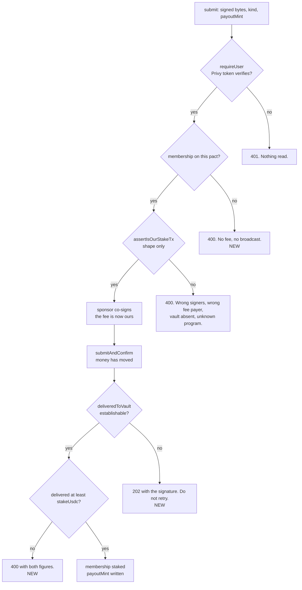

# Consistently: buildathon submission

A crew agrees a rule and each member stakes real money on keeping it. Whoever breaks the rule
forfeits their stake to the people who kept it, automatically. This branch takes that from a
half-built app to something deployed and defensible.

Two environments:

| | | |
|---|---|---|
| **Production** | https://web-production-8764a.up.railway.app | Solana mainnet, real money |
| **Rehearsal** | https://web-rehearsal-df0c.up.railway.app | `STAKE_DRY_RUN=1`, separate database |

Rehearsal runs the whole money path except the broadcast: the route is priced, the member
signs, the sponsor co-signs, the guard checks it, and the transaction is simulated against live
mainnet with signature verification on. The funding gate offers a way through rather than
demanding SOL. It exists so the demo can be walked end to end without spending anything, and so
practice pacts never appear in the database a judge sees.

The README is rewritten and accurate as of this head. New: [`docs/ARCHITECTURE.md`](docs/ARCHITECTURE.md)
for the flow with diagrams, [`docs/security/escrow-protocol.md`](docs/security/escrow-protocol.md)
for custody.

## Read this part first

Two money-path defects in pre-existing code, both found while *writing* the custody document rather
than while testing. Neither was in code any planned task had been asked to touch.

**The stake guard checked shape and never amount.** `assertIsOurStakeTx` verified that a
transaction looked like an order we built — two signers, our sponsor as fee payer, this vault
present, only DFlow's programs — and never read how much USDC it delivered. A member could
hand-build that shape carrying one atomic unit and be recorded fully staked. `settlePact` pays each
winner a whole principal out of the vault's *actual* balance, so an under-staker who kept the rule
would have been paid a full stake out of the money the rest of the crew put in.

The amount is now taken from the transaction that landed, not the one we were asked to sign:
`finaliseStake` broadcasts, waits for confirmation, and asks the chain what that signature moved,
from `getTransaction`'s `preTokenBalances` and `postTokenBalances` (`deliveredToVault`). Every way
of not knowing ends in a refusal rather than a default — an erroring node, a transaction not served
back, an absent balance array, a USDC row that does not name its owner. The obvious version reads
the vault balance either side of the broadcast and takes the rise; that was written first and
replaced, because any USDC landing in the window counts, including the attacker's own.

**A non-member could deliver a full stake and be answered with a 500.** The membership was first
read at the `update` that records the stake, which happens *after* the broadcast. A caller with no
row put money in a crew's vault and got back a Prisma `P2025` rendered as *"That did not go
through"* — said to somebody whose transaction had just confirmed. A member told their stake failed
stakes again and pays twice. The membership is now read before the sponsor signs and before
anything is sent.

## Where the guards sit now

## The rest of the branch

- **A payout token per member**, chosen at stake time, written in the same update that flips the
  membership to `staked`. `PAYOUT_MINTS` is an allowlist: an unroutable mint is a payout that
  silently never lands. Settlement builds one DFlow order per winner.
- **Reference photos** on pact creation, shown above the camera at check-in. Nothing compares them.
- **One upload endpoint** (`POST /api/uploads`) behind every image path.
- **A profile** — name, avatar, bio, four social links — and **email linked to a wallet** for
  recovery, both through `PATCH /api/me`, which reads the caller from a verified token.
- **A GitHub contribution calendar**, rebuilt on `var(--ink)` at rising opacity because `DESIGN.md`
  reserves colour for money.
- **The theme toggle moved into the nav bar.**
- **`/settle force`**, because a week cannot be waited out in front of a room. Nothing but the
  exact word turns it on; a typo comes back as not understood rather than falling through.

## Verification

`214 tests`, clean typecheck, clean production build. Every task was individually reviewed, then a
whole-branch review, then fix rounds on both.

The build is in that list because type declarations can lie about runtime exports:
`@privy-io/react-auth` declares `PrivyErrorCode` and does not ship it, so typecheck passed and the
production build did not.

## What this does not have

- **No transaction has been executed on mainnet.** The sponsor wallet is unfunded, so there are no
  transaction links and nobody has watched a stake land in a vault. Everything below the browser has
  been exercised against live mainnet state by simulation only.
- **The demo script has not been walked end to end**, only derived from reading the code.
- **Custody is server-side.** Stakes sit in a per-pact vault whose key we hold, encrypted. We can
  take the money; the custody document says so in its first sentence and then says exactly how, what
  the on-chain replacement would do, and why it is not in this submission.
- **Authentication is partial.** The check-in, feed, reaction and exemption routes still take the
  wallet from the request body, so settlement's inputs are forgeable. That is the one finding an
  on-chain escrow would not fix.

## Worth a reviewer's attention

`deliveredToVault` and the post-broadcast block in `lib/stake.ts` are where the money decisions are.
The two refusal paths deliberately return different statuses: `StakeGuardError` is 400 because it is
a fact about the caller, `SubmitError` is 202 with the signature because it is a fact about us and
retrying would charge them twice.
